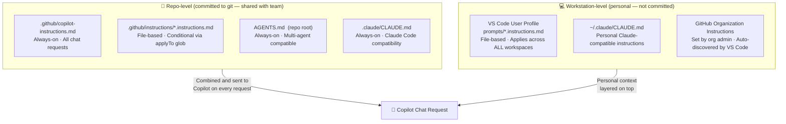
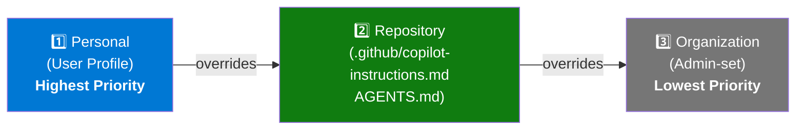
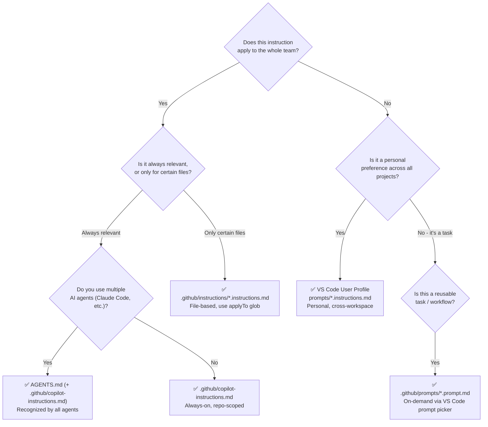

# Module 01 — Customization

> **What you'll learn:** How to control what context GitHub Copilot automatically receives on every request — at the repository level (shared with your team) and at the workstation level (personal). Covers all instruction file types, prompt files, agent modes, agent skills, and organization-level instructions.

---

## Where Do Instruction Files Live?

---

## Instruction Priority (Conflict Resolution)

When multiple instruction sources provide conflicting guidance, Copilot resolves them in this order:

> All sources are **combined** and included in the context. Priority only matters when instructions **conflict**.

---

## Which Mechanism Should I Use?

---

## Contents

| Doc | What it covers |
|-----|---------------|
| [docs/always-on-instructions.md](docs/always-on-instructions.md) | `copilot-instructions.md`, `AGENTS.md`, `CLAUDE.md` — always-on files |
| [docs/file-based-instructions.md](docs/file-based-instructions.md) | `*.instructions.md` — conditional, file-pattern-based instructions |
| [docs/prompt-files.md](docs/prompt-files.md) | `*.prompt.md` — on-demand reusable prompts |
| [docs/agent-modes.md](docs/agent-modes.md) | Ask / Edit / Agent mode comparison |
| [docs/agent-skills.md](docs/agent-skills.md) | Agent skills and `#tool:` syntax |
| [docs/org-instructions.md](docs/org-instructions.md) | Organization-level instructions |

---

## Live Examples in This Repo

The `.github/` folder contains working examples of everything covered in this module.

| File | Type | Live? |
|------|------|-------|
| [.github/copilot-instructions.md](../.github/copilot-instructions.md) | Always-on repo instruction | ✅ Active now |
| [AGENTS.md](../AGENTS.md) | Multi-agent always-on | ✅ Active now |
| [.github/instructions/csharp-standards.instructions.md](../.github/instructions/csharp-standards.instructions.md) | File-based (`applyTo: **/*.cs`) | ✅ Active now |
| [.github/instructions/test-standards.instructions.md](../.github/instructions/test-standards.instructions.md) | File-based (`applyTo: **/*Tests.cs`) | ✅ Active now |
| [.github/prompts/code-review.prompt.md](../.github/prompts/code-review.prompt.md) | Prompt file | ✅ Available in picker |
| [.github/prompts/generate-tests.prompt.md](../.github/prompts/generate-tests.prompt.md) | Prompt file | ✅ Available in picker |
| [.vscode/settings.json](../.vscode/settings.json) | Workspace-scoped settings | ✅ Active now |

> See [.github/FILES.md](../.github/FILES.md) for a quick overview of all live demo files.

---

## Try It Now

1. Open Copilot Chat (`Ctrl+Alt+I`)
2. Ask: *"What coding conventions apply to this project?"*
3. Copilot will describe the C#/.NET rules from `.github/copilot-instructions.md` — those come from this repo's instruction file.
4. Then try: click the **Attach** (📎) icon → **Prompt Files** → select `Code Review` to run a structured review.
