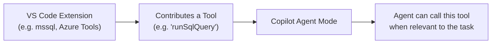

# Agent Skills

Agent skills (also called **tools** in Copilot's underlying model) are capabilities that Copilot can invoke during an Agent mode session. They extend what the agent can do beyond reading and writing files.

---

## Built-in Skills

GitHub Copilot in VS Code comes with several built-in skills that are always available in Agent mode:

| Skill | What it does |
|-------|-------------|
| `readFile` | Reads the contents of a file in the workspace |
| `writeFile` | Creates or modifies a file |
| `runCommand` | Runs a shell command in the integrated terminal |
| `searchWorkspace` | Searches for text or symbols across the workspace |
| `listDirectory` | Lists files/folders in a directory |
| `githubRepo` | Queries the GitHub API for repo information |

---

## Extension-Contributed Skills

VS Code extensions can contribute additional skills/tools that Copilot can discover and use. When you install an extension that contributes tools, they become available to Copilot in Agent mode automatically.



**Examples:**
- **mssql extension** — contributes database query tools (see Module 07)
- **GitHub Pull Requests extension** — contributes PR management tools
- **Azure Tools extensions** — contribute Azure resource management tools

---

## Referencing Tools in Instructions Files

You can tell Copilot to use specific tools by referencing them in your instruction files or prompt files:

```markdown
---
name: "Database Query Helper"
applyTo: "**/*.sql"
---

When working with SQL files, use #tool:runSqlQuery to validate
queries against the connected database before suggesting them.
```

The `#tool:<tool-name>` syntax signals to the agent that it should consider using that tool.

---

## Controlling Which Tools Are Used

In Agent mode, you can see which tools Copilot has access to by looking at the **tool indicators** in the chat. You can also:

- **Allow/deny specific tools** when Copilot requests to use them — a confirmation prompt appears before any tool that modifies files or runs code
- **Disable Agent mode tools** entirely via workspace settings if needed

---

## Custom Agents

Beyond skills, VS Code supports **custom agents** — fully defined AI agents with their own identity, tools, and instruction sets. Custom agents appear in the Copilot Chat `@mention` picker.

Example: `@permit-bot` could be a custom agent configured with knowledge of the permit system's architecture and access to specific tools.

See: [Create custom agents — VS Code Docs](https://code.visualstudio.com/docs/copilot/customization/custom-agents)

---

## Further Reading

- [VS Code: Agent Skills](https://code.visualstudio.com/docs/copilot/customization/agent-skills)
- [VS Code: Custom Agents](https://code.visualstudio.com/docs/copilot/customization/custom-agents)
- [Awesome Copilot — community examples](https://github.com/github/awesome-copilot)
