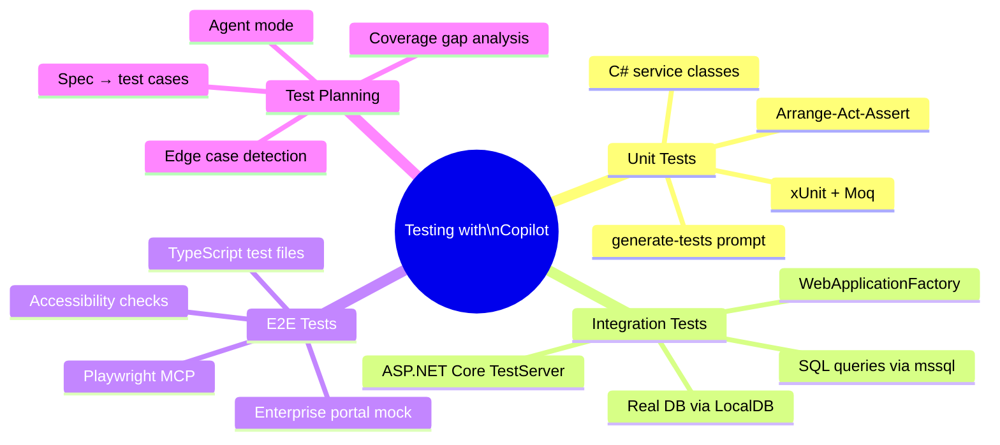
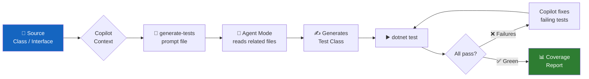
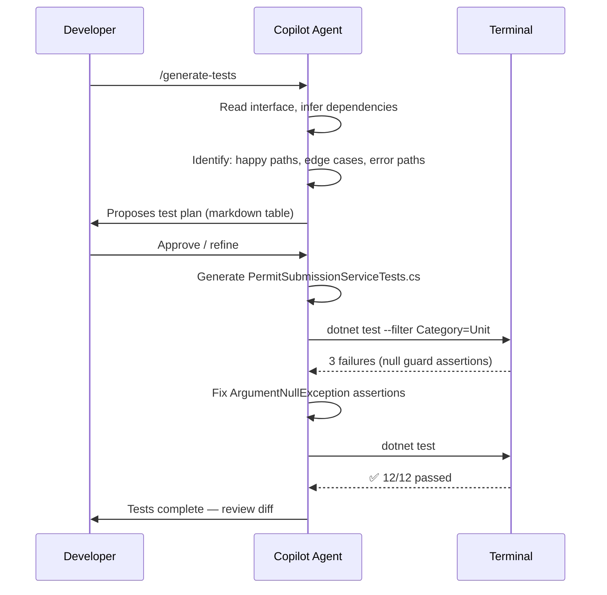
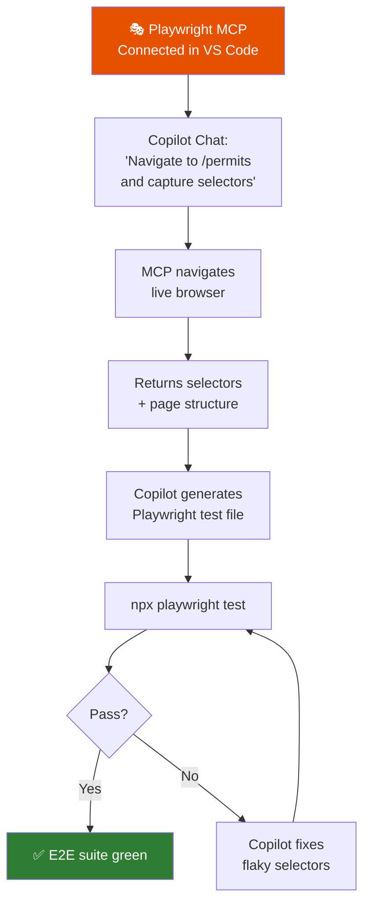

# Module 06 — QA & Testing with GitHub Copilot

[](.)
[](.) [](.)

> **Learning objectives:** Use Copilot to generate unit tests, integration tests, and Playwright end-to-end tests. Use Agent mode to build complete test plans from specifications.

---

## Why Copilot + Testing?

Writing tests is time-consuming but essential. Copilot accelerates three test-creation patterns:

1. **Unit tests from code** — select a class, ask for xUnit + Moq coverage
2. **Test plans from specs** — give a business requirement, get structured test cases
3. **UI tests from a running page** — Playwright + MCP captures selectors automatically

---

## Testing Landscape



---

## Test Generation Pipeline



---

## Agent Mode Test-Plan Workflow



---

## Playwright + MCP Workflow



---

## Module Structure

```
06-qa-testing/
├── README.md                        ← This file
├── docs/
│   ├── testing-strategies.md        ← Unit / integration / E2E overview
│   ├── test-plan-generation.md      ← Worked example: spec → Copilot test plan
│   └── playwright-ui-testing.md     ← Playwright MCP setup + generated tests
├── csharp-unit-tests/
│   ├── PermitService.cs             ← Service under test (SUT)
│   └── PermitServiceTests.cs        ← Copilot-generated xUnit + Moq tests
└── playwright-samples/
    ├── package.json
    ├── playwright.config.ts
    ├── index.html                   ← Mock enterprise service portal
    └── tests/
        ├── permit-submission.spec.ts
        ├── permit-search.spec.ts
        └── accessibility.spec.ts
```

---

## Quick Start

```bash
# C# unit tests
cd 06-qa-testing/csharp-unit-tests
dotnet test --logger "console;verbosity=detailed"

# Playwright E2E tests
cd 06-qa-testing/playwright-samples
npm install
npx playwright install chromium
npx playwright test

# View HTML report
npx playwright show-report
```

---

## Key Prompts

| Goal | Prompt |
|---|---|
| Generate unit tests | `/generate-tests` prompt file + `#file:MyService.cs` |
| Test plan from interface | "Given this interface, write a structured test plan covering all methods, happy paths, edge cases, and error conditions" |
| Fix failing test | "This test fails with [error]. Fix the test without changing the implementation" |
| Improve coverage | "What test cases are missing from this test class to reach 90% branch coverage?" |
| Playwright locators | "Using Playwright MCP, navigate to /permits and generate stable locators for all form inputs" |
| Accessibility test | "Generate a Playwright test that checks this page passes WCAG 2.1 AA using axe-core" |

---

## Prerequisites

- .NET 8 SDK
- Node.js 20+
- VS Code with GitHub Copilot + Chat
- Playwright MCP connected (`03-mcp-samples/playwright-mcp/`)
- Module 03 MCP setup complete

---

## Related Modules

- [Module 03 — MCP Servers](../03-mcp-samples/README.md) (Playwright MCP setup)
- [Module 07 — Databases](../07-databases/README.md) (SQL query testing)
- [Module 10 — Lab Exercise 05](../10-hands-on-lab/exercises/exercise-05-testing.md)
