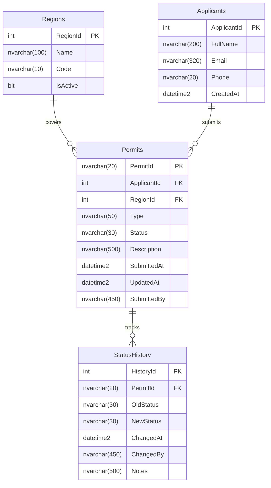
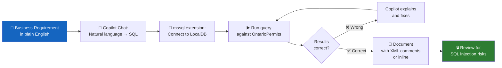
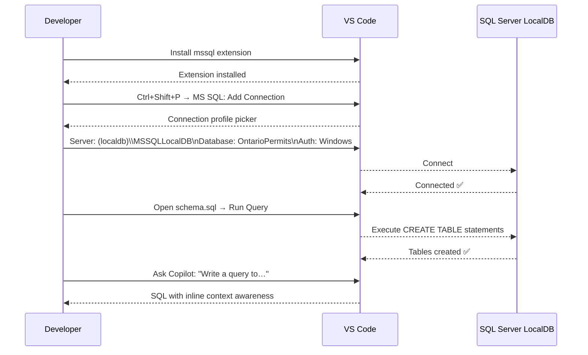

# Module 07 — Databases with GitHub Copilot

[](.)
[](.) [](.)

> **Learning objectives:** Use the `mssql` VS Code extension with GitHub Copilot to write, explain, optimise, and document T-SQL for a realistic enterprise schema. Use Copilot Chat to convert natural-language requirements into production-quality SQL.

---

## Schema Overview — OntarioPermits



---

## Copilot + mssql Workflow



---

## mssql Extension Setup



---

## Module Structure

```
07-databases/
├── README.md                           ← This file
├── docs/
│   ├── mssql-extension.md              ← Install, connect, keyboard shortcuts
│   └── copilot-sql-patterns.md         ← Natural language → SQL patterns
├── samples/
│   ├── schema.sql                      ← CREATE TABLE statements (4 tables)
│   ├── queries.sql                     ← 10 annotated SELECT queries
│   └── stored-procedures.sql           ← 2 SPs: before/after Copilot refactor
└── .vscode/
    └── settings.json                   ← mssql connection profile
```

---

## Quick Start

```bash
# 1. Ensure SQL Server LocalDB is installed (comes with Visual Studio)
sqllocaldb create OntarioPermits
sqllocaldb start OntarioPermits

# 2. Connect via mssql extension (Ctrl+Shift+P → MS SQL: Add Connection)
#    Server:   (localdb)\MSSQLLocalDB
#    Database: OntarioPermits
#    Auth:     Windows Authentication

# 3. Open schema.sql in VS Code and press Ctrl+Shift+E to run

# 4. Open queries.sql and run individual queries with Ctrl+Shift+E
```

---

## Key Copilot Prompts

| Goal | Prompt |
|---|---|
| Generate a query | "Write a T-SQL query to list all active construction permits in the Toronto region, ordered by submission date descending" |
| Explain a query | "Explain this T-SQL query in plain English for a non-developer" |
| Optimise | "This query runs slowly on 1M rows. Suggest indexes and rewrite to avoid the cursor" |
| Stored procedure | "Convert this ad-hoc query into a parameterised stored procedure that guards against SQL injection" |
| Schema changes | "Write an ALTER TABLE statement to add a non-nullable AuditUserId column to Permits with a default of SYSTEM_USER" |
| Data migration | "Write a T-SQL migration script to add a Notes column to StatusHistory and backfill it with 'Migrated' for all existing rows" |

---

## Prerequisites

- SQL Server LocalDB (included with Visual Studio 2022)
  Or: SQL Server Express / Developer Edition
- VS Code `mssql` extension (`ms-mssql.mssql`)
- GitHub Copilot + Chat

---

## Related Modules

- [Module 05 — App Modernization](../05-app-modernization/README.md) (legacy JDBC/ADO.NET patterns)
- [Module 06 — QA & Testing](../06-qa-testing/README.md) (test data seeding)
- [Lab Exercise 04](../10-hands-on-lab/exercises/exercise-04-modernization.md)
