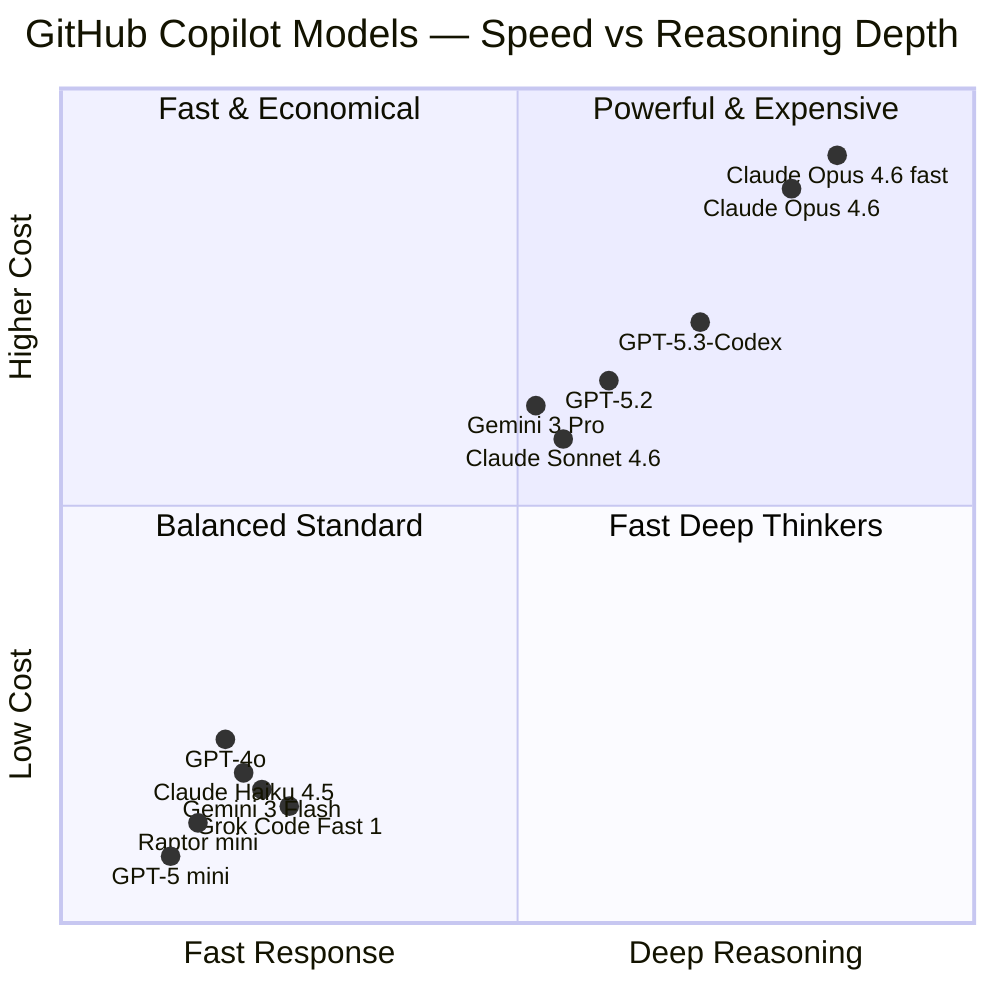
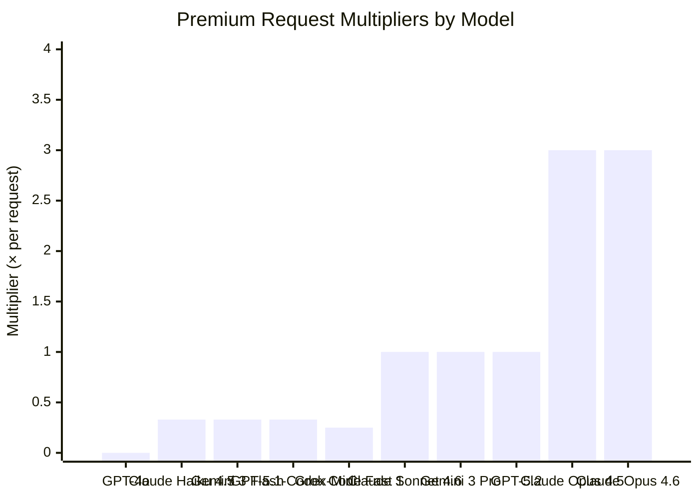
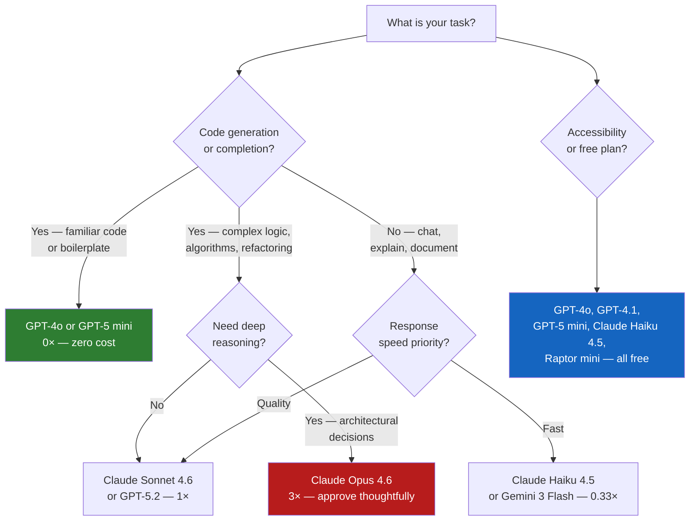

# Module 08 — Models & Context

[](.)
[](.) [](.)

> **Learning objectives:** Understand which AI models are available in GitHub Copilot, how premium request multipliers work, and how to manage context windows effectively for large codebases.

> **Data accuracy note:** Model table data sourced from [GitHub Docs — Supported Models](https://docs.github.com/en/copilot/reference/ai-models/supported-models) on **2026-02-23**. Model availability changes frequently — always verify against live docs.

---

## Model Landscape (as of 2026-02-23)

GitHub Copilot provides access to models from **Anthropic**, **Google**, **OpenAI**, **xAI**, and **GitHub**. Model availability depends on your Copilot plan.

### Speed vs Reasoning Quadrant



---

## Premium Request Multipliers

When your plan includes a **monthly premium request allowance**, each model consumes a different fraction of that budget.



> **Claude Opus 4.6 fast mode (preview)** has a 30× multiplier and is not shown on this chart to maintain scale.

---

## Model Selection Decision Tree



---

## Module Structure

```
08-models-context/
├── README.md                    ← This file (model table + multipliers)
├── docs/
│   ├── models-reference.md      ← Full model table with live data (2026-02-23)
│   ├── context-management.md    ← Managing context windows effectively
│   └── model-selection-guide.md ← Practical guide for enterprise devs
```

---

## Context Window Quick Reference

| Model | Context Window | Notes |
|---|---|---|
| GPT-4o | 128k tokens | Strong code understanding |
| Claude Sonnet 4.6 | 200k tokens | Excellent for large codebases |
| Claude Opus 4.6 | 200k tokens | Best for deep analysis |
| Gemini 3 Pro | 1M tokens | Largest context available |
| GPT-5.2 | 128k tokens | Strong code generation |

> **1 token ≈ 4 characters.** A 200k token context can hold approximately 150,000 words — the equivalent of a large novel, or a mid-size C# project.

---

## Quick Tips

| Tip | Detail |
|---|---|
| **Default to GPT-4o for completions** | Zero cost — use it heavily in Edit mode |
| **Escalate to Sonnet for Agent mode** | Complex multi-step tasks benefit from stronger reasoning |
| **Use Gemini 3 Pro for large files** | 1M token context handles the largest enterprise codebases |
| **Reserve Opus for architecture reviews** | 3× cost is justified for high-stakes design decisions |
| **Free plan? All 0× models are always free** | Your allowance is not consumed by zero-cost models |

---

## Related Modules

- [Module 01 — Customization](../01-customization/README.md) (per-model instruction files)
- [Module 02 — VS Code Agents](../02-vscode-agents/README.md) (model selection in Agent mode)
- [Module 09 — Copilot on GitHub.com](../09-copilot-on-github/README.md) (Coding Agent model options)
