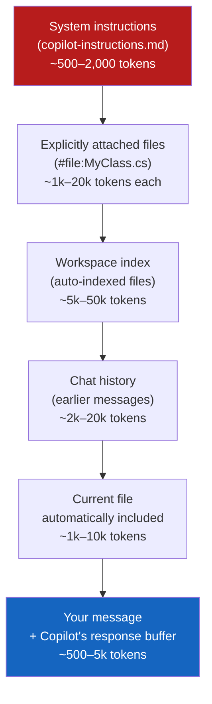

# Context Management

> **Goal:** Understand what fills Copilot's context window, how to maximise the signal-to-noise ratio, and what to do when working with large enterprise codebases.

---

## What Is a Context Window?

Every AI model has a **context window** — the maximum amount of text it can process in a single interaction. Everything Copilot "knows" about your current task fits within this window:

```
Context window = System prompt
               + copilot-instructions.md contents
               + attached #files
               + chat history
               + current file content
               + streaming output buffer
```

When the window fills up, older content is **silently dropped** — Copilot won't tell you this happened.

---

## Context Window Sizes

| Model | Tokens | Approx. characters | Approx. lines of C# |
|---|---|---|---|
| GPT-4o / GPT-5.x | 128k | ~512,000 | ~12,800 |
| Claude Haiku / Sonnet / Opus | 200k | ~800,000 | ~20,000 |
| Gemini 3 Pro / 3.1 Pro | 1,000k | ~4,000,000 | ~100,000 |
| GPT-4.1 | 1,000k | ~4,000,000 | ~100,000 |

> **Rule of thumb:** 1 token ≈ 4 characters ≈ 0.75 words.
> A typical C# class (100–300 lines) ≈ 1,000–3,000 tokens.

---

## What Fills the Context Window?

### Priority order (highest → lowest, approximate)



---

## Strategies for Large Codebases

### 1. Use `#file` selectively

Attach only the files **directly relevant** to your task. Attaching too many files wastes context.

```text
❌ Too broad:
#file:Controllers/PermitController.cs
#file:Services/PermitService.cs
#file:Repositories/PermitRepository.cs
#file:Models/Permit.cs
... 12 more files

✅ Targeted:
#file:Services/PermitService.cs   ← the file you're changing
Explain the CancelAsync method and suggest adding idempotency.
```

### 2. Use `#sym` for targeted symbol lookup

```text
#sym:IPermitService
What does this interface contract guarantee about concurrency?
```

### 3. Use `@workspace` sparingly in Agent mode

`@workspace` triggers workspace-wide indexing. It's powerful but expensive in terms of context. Use it when you need cross-file reasoning.

### 4. Break large tasks into focused sub-sessions

Instead of one giant prompt:

```text
❌ One huge prompt — risks context overflow
"Refactor the entire permits workflow: migrate PermitController,
PermitService, PermitRepository, all models, all tests, and update
Program.cs..."

✅ Sequential focused sessions
Session 1: "Refactor PermitRepository to use IDisposable properly"
Session 2: "Update PermitService to depend on the refactored IPermitRepository"
Session 3: "Update PermitController tests for the new service contract"
```

---

## Managing `copilot-instructions.md` Size

The `.github/copilot-instructions.md` is included in **every** Copilot request. Keep it focused:

| Rule | Guidance |
|---|---|
| Keep under 2,000 tokens | Roughly 8,000 characters or 150–200 lines |
| Remove redundant rules | Don't repeat standard .NET conventions Copilot already knows |
| Use file-based instructions for scope | Move C#-specific rules to `csharp-standards.instructions.md` with `applyTo: **/*.cs` |
| No examples in always-on instructions | Put code examples in prompt files, not copilot-instructions.md |

---

## Detecting Context Window Issues

Signs you're hitting the context limit:

| Symptom | Likely cause |
|---|---|
| Copilot "forgets" earlier instructions in a long chat | Chat history exceeds context window |
| Copilot ignores the `copilot-instructions.md` rules mid-session | Instructions were pushed out by large file attachments |
| Completions become less accurate over a long Agent session | Accumulated output has filled the window |
| Agent mode starts asking for information it had earlier | Context was trimmed |

**Fix:** Start a new chat session, re-attach only the files you need.

---

## Context Tips for Enterprise Projects

Legacy enterprise systems often have large files. Strategies that work:

| Scenario | Strategy |
|---|---|
| Legacy WCF service (5,000 lines) | Split into sections, work per method |
| Large SQL schema (100+ tables) | Use `sql-query.prompt.md` which references the schema inline |
| Monolithic ASP.NET MVC app | Use `@workspace` once to index, then use `#sym` for targeted access |
| Multi-project solution | Open only the relevant project in VS Code, not the entire monorepo |

---

## Related

- [Models Reference](models-reference.md) — Context window sizes by model
- [Model Selection Guide](model-selection-guide.md) — Picking the right model for context-heavy tasks
- [Module 01 — Instructions files](../../01-customization/docs/always-on-instructions.md) — Keeping instructions lean
