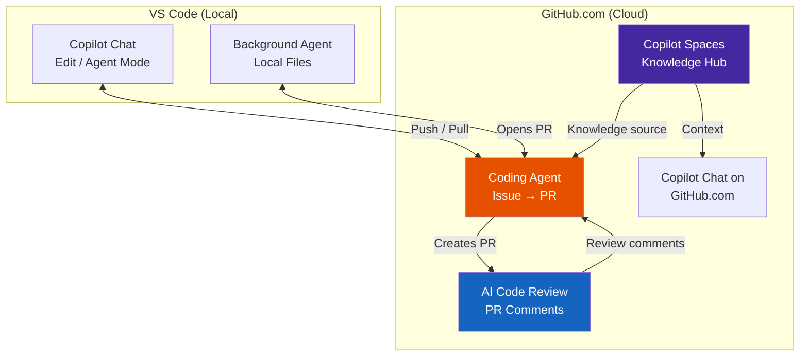
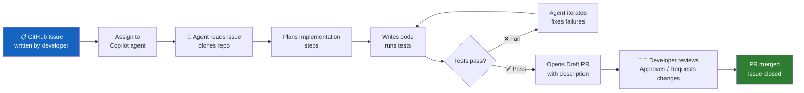
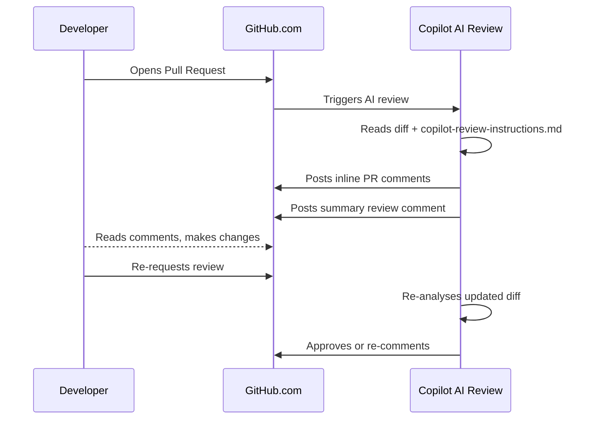
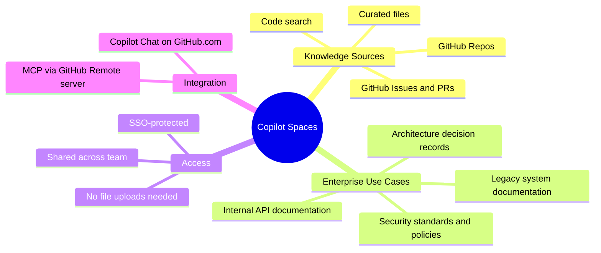

# Module 09 — Copilot on GitHub.com

[](.)
[](.) [](.)

> **Learning objectives:** Use Copilot features that live on GitHub.com itself — Coding Agent, AI code review, and Copilot Spaces — separately from VS Code.

---

## GitHub.com Feature Architecture



---

## Coding Agent Lifecycle



---

## AI Code Review Sequence



---

## Copilot Spaces Mindmap



---

## Module Structure

```
09-copilot-on-github/
├── README.md
└── docs/
    ├── coding-agents.md         ← Coding Agent: issue → PR lifecycle
    ├── code-review.md           ← AI code review + copilot-review-instructions.md
    └── copilot-spaces.md        ← Spaces: knowledge sources + Ontario use cases
```

---

## Quick Reference

| Feature | Where | Access |
|---|---|---|
| Coding Agent | GitHub.com — Issues | Assign issue to "Copilot" |
| AI Code Review | GitHub.com — Pull Requests | Auto-triggers on PR open |
| Copilot Chat (web) | GitHub.com — any page | Click Copilot icon (top nav) |
| Copilot Spaces | GitHub.com — Spaces tab | Team / org level |

---

## Related Modules

- [Module 02 — VS Code Agents](../02-vscode-agents/README.md) — Background Agent (VS Code side)
- [Module 03 — MCP Servers](../03-mcp-samples/github-remote-mcp/README.md) — GitHub Remote MCP
- [Module 08 — Models](../08-models-context/README.md) — Model selection for Coding Agent
