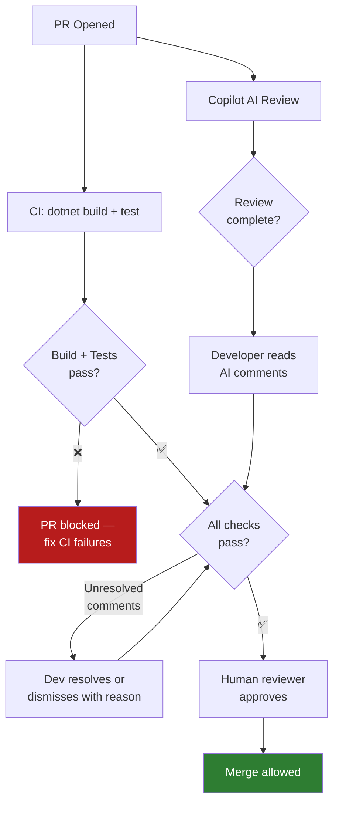

# AI Code Review on GitHub.com

> **Copilot AI code review** analyses pull requests and posts inline comments — automatically, before any human has looked at the PR.

---

## How It Works

When a PR is opened (or updated) in a repository with AI code review enabled:

1. Copilot reads the **entire diff** plus the surrounding context
2. Reads `.github/copilot-instructions.md` and `.github/copilot-review-instructions.md` if present
3. Posts **inline diff comments** on specific lines
4. Posts a **summary comment** on the PR overview
5. **Does not approve or block** — it comments only (humans always approve)

---

## Enabling AI Code Review

In your GitHub org or repo settings:

```
Settings → Copilot → Code Review → Enable for all PRs
```

Or target specific code owners:

```
Settings → Copilot → Code Review → Enable for PRs assigned to specific teams
```

---

## Customising Reviews with `copilot-review-instructions.md`

Create `.github/copilot-review-instructions.md` in your repository to give Copilot specific review criteria.

### Example — Permits review instructions

```markdown
# Copilot Code Review Instructions

## Focus Areas

### Security
- Flag any string concatenation in SQL queries — must use parameterised queries
- Flag any hardcoded connection strings or API keys
- Flag any direct use of `new HttpClient()` — must use IHttpClientFactory
- Flag logging of PII (email addresses, names, SINs, health card numbers)

### Enterprise Standards
- All public API endpoints must have XML documentation comments
- Response types must use `IActionResult` or `ActionResult<T>` — not raw objects
- Controllers must not contain business logic — delegate to services

### .NET 8 Patterns
- Flag use of `.Result` or `.Wait()` on Task — must use await
- Flag `ConfigurationManager` usage — must use IConfiguration
- Flag `Console.WriteLine` — must use ILogger<T>

### Testing
- New public methods must have corresponding test cases
- Tests must follow Arrange/Act/Assert structure
- Test method names must follow MethodName_StateUnderTest_ExpectedBehavior pattern

## Out of Scope
- Styling/formatting (this is handled by the auto-formatter)
- Comment capitalization
- File organization (handled by architecture review, not PR review)
```

---

## What Good AI Review Comments Look Like

### Inline comment — security issue

```
Line 34 in PermitRepository.cs

🔒 Security: This uses string concatenation to build a SQL query.
An attacker who controls `permitType` could perform SQL injection.

Replace with a parameterised query:
```sql
WHERE Type = @Type
```
And pass `@Type` as a `SqlParameter`.
```

### Inline comment — .NET pattern

```
Line 12 in PermitController.cs

⚠️ Anti-pattern: `new HttpClient()` is used directly.
This can cause socket exhaustion under load.

Use constructor-injected `IHttpClientFactory` instead:
```csharp
public PermitController(IHttpClientFactory httpClientFactory) { ... }
var client = _httpClientFactory.CreateClient("PermitApi");
```
```

### Summary comment

```
## Copilot Code Review Summary

✅ No security issues found in the main logic.

⚠️ 2 suggestions:
1. Line 34 — Parameterise the SQL query (see inline comment)
2. Line 12 — Use IHttpClientFactory (see inline comment)

ℹ️ All error handling paths appear covered.
ℹ️ Tests are present and follow Arrange/Act/Assert.
```

---

## Quality Gates — Combining AI Review with Branch Protection



---

## Limitations to Know

| Limitation | Notes |
|---|---|
| AI review does not block merges | It's advisory, not a gate — configure branch protection separately |
| Does not see runtime behaviour | Static analysis only — cannot catch concurrency bugs that only manifest at load |
| Context limited to the diff | It may miss issues that only appear when combined with unchanged code |
| May produce false positives | Always read the comment and verify — don't blindly apply all suggestions |

---

## Related

- [Coding Agents](coding-agents.md) — The agent that creates the PRs being reviewed
- [.github/prompts/code-review.prompt.md](../../.github/prompts/code-review.prompt.md) — Manual code review prompt for VS Code Chat
- [Module 01 — copilot-instructions.md](../../01-customization/docs/always-on-instructions.md)
