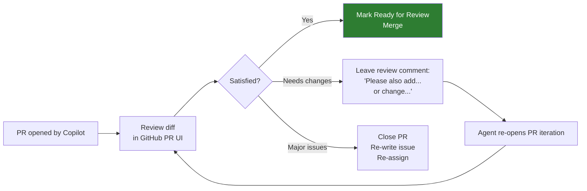

# Copilot Coding Agent on GitHub.com

> **The Coding Agent** is an autonomous AI developer you can assign GitHub Issues to. It works in a cloud environment, writes code, runs tests, and opens a pull request for you to review.

---

## What Is the Coding Agent?

The Coding Agent is GitHub Copilot's fully autonomous cloud agent. Unlike Background Agent in VS Code (which runs locally), the Coding Agent:

- Runs in a **secure cloud sandbox** — no local machine required
- Works from **GitHub Issues** directly — you don't need VS Code open
- Produces a **fully reviewed Draft PR** with a description, code, and test results
- Supports **iterative feedback** — you can comment on the PR and the agent will iterate

---

## How to Assign an Issue to the Coding Agent

### Method 1 — Assignee

1. Open a GitHub Issue
2. In the "Assignees" panel, select **Copilot** from the user picker
3. The agent starts within minutes

### Method 2 — `@github-copilot` mention

Comment in an issue:

```
@github-copilot start working on this
```

### Method 3 — Slash command from Copilot Chat on GitHub.com

```
/agent Implement the feature described in issue #47
```

---

## Writing Effective Issues for the Coding Agent

The Coding Agent performs best when issues are specific and testable.

### Good issue structure

```markdown
## Summary
Add a `CancelAsync` method to `IPermitService` that cancels a permit
if and only if its current status is `PENDING`.

## Acceptance Criteria
- [ ] `CancelAsync(string permitId)` added to `IPermitService`
- [ ] Implementation in `PermitService.cs` that validates status
- [ ] Returns `true` if cancelled, `false` if not cancellable, throws if not found
- [ ] xUnit tests: pending→cancelled (true), approved→no change (false), not found (throws)
- [ ] All existing tests still pass (`dotnet test`)

## Files to modify
- `Services/IPermitService.cs`
- `Services/PermitService.cs`
- `Tests/PermitServiceTests.cs`
```

### Anti-patterns that confuse the agent

| ❌ Vague | ✅ Specific |
|---|---|
| "Fix the permits code" | "Fix the null reference on line 47 of PermitRepository.cs when Region is null" |
| "Add tests" | "Add xUnit tests for PermitService.CancelAsync covering the 3 scenarios in the spec" |
| "Refactor everything" | "Refactor PermitController to replace Console.WriteLine with ILogger — no other changes" |
| "Make it faster" | "The GetPermitsByRegion query has no index on RegionId. Add an index and verify query plan improves" |

---

## What the Agent Can and Cannot Do

| Capability | Coding Agent |
|---|---|
| Read all repo files | ✅ |
| Write and edit files | ✅ |
| Run `dotnet build` and `dotnet test` | ✅ |
| Run `npm test` / `pytest` | ✅ |
| Install dependencies | ✅ (sandboxed) |
| Access external services | ❌ (no internet) |
| Access secrets/environment variables | ⚠️ Configurable — use with caution |
| Open PRs | ✅ |
| Merge PRs | ❌ — always requires human approval |
| Push to `main` directly | ❌ — works on a branch |

---

## Reviewing the Coding Agent's PR

The Coding Agent opens a **Draft PR** tagged with the Copilot label. Your review workflow:



### Commenting for iteration

Any comment on the PR that mentions what to change will trigger another agent iteration:

```
The CancelAsync method needs to also log a warning when the permit status is
not PENDING. Use _logger.LogWarning. Update the test to verify the log call.
```

---

## Security and Governance — Enterprise Notes

| Consideration | Recommendation |
|---|---|
| **Code review required** | All Coding Agent PRs must be reviewed by a human before merge — no exceptions |
| **Secrets in the sandbox** | Do not configure production secrets in the agent's environment |
| **Branch protection** | Ensure `main` branch protection rules require review — the agent cannot bypass them |
| **MFIPPA data** | Do not use issues containing personal information as agent input |
| **Audit trail** | All agent commits are labelled — full audit trail is available in git history |

---

## Related

- [AI Code Review](code-review.md) — What happens after the agent opens the PR
- [Background Agent](../../02-vscode-agents/docs/background-agent.md) — Local equivalent
- [Agent Selection Guide](../../02-vscode-agents/docs/agent-selection-guide.md)
