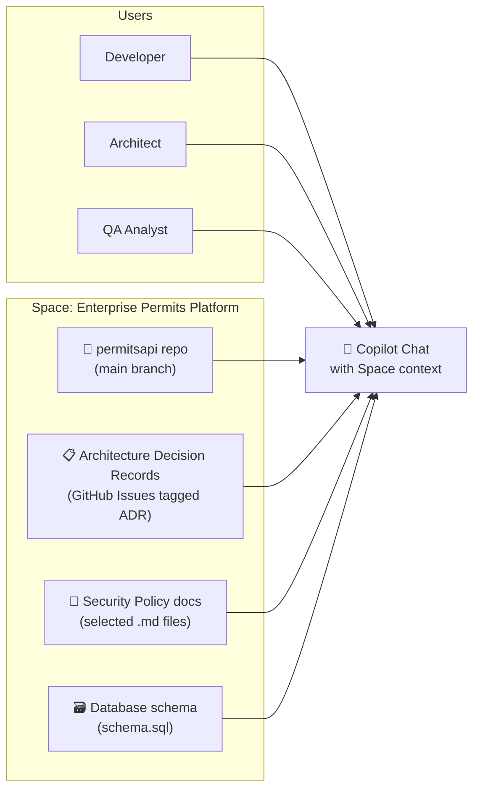

# Copilot Spaces

> **Copilot Spaces** is a knowledge management feature on GitHub.com that lets teams curate a collection of context sources (repos, files, docs) and share them as a persistent knowledge base accessible from Copilot Chat.

---

## What Is a Space?

A Space is a **named, shared context container** that you build once and reuse across many Copilot Chat sessions.



---

## Why Use Spaces?

Without a Space, every team member must manually attach context files to each Copilot Chat session — and that context disappears when the session ends.

With a Space:

| Without Space | With Space |
|---|---|
| Each dev attaches their own files | Context is centralised and curated once |
| New team members lack context | New members instantly access team knowledge |
| ADRs and policies get forgotten | Always available in every chat |
| Context lost between sessions | Persistent across all sessions |
| Knowledge silos per developer | Shared understanding across the team |

---

## Creating a Space

1. Go to **github.com** → top navigation → **Copilot** icon → **Spaces**
2. Click **New Space**
3. Give it a name (e.g., `Enterprise Permits Platform`)
4. Add knowledge sources (see below)
5. Share with your team by adding collaborators

---

## Knowledge Source Types

| Source type | What it includes | Example |
|---|---|---|
| **GitHub Repository** | All files in the repo (or specific branches) | `enterprise/permitsapi` |
| **GitHub Issues & PRs** | Selected labels, milestones, or all | Issues labelled `ADR` |
| **Selected files** | Cherry-pick specific markdown, SQL, or code files | `docs/architecture/*.md` |
| **Code search results** | Files matching a code search pattern | All `*.csproj` files |

---

## Enterprise Use Cases

### Use Case 1 — Platform knowledge base

```
Space: OPS Digital Services — Permits Platform

Sources:
- Repo: enterprise/permitsapi (branch: main)
- Issues: tagged #architecture-decision
- Files: docs/security-policy.md, docs/aoda-requirements.md
- Files: 07-databases/samples/schema.sql

Team prompts:
"What is the data residency policy for permit records?"
"Summarise all architecture decisions made since January"
"What database tables store status history?"
```

### Use Case 2 — Legacy modernization team

```
Space: Modernization — WCF to .NET 8

Sources:
- Repo: enterprise/legacy-permits-wcf (old system)
- Repo: enterprise/permits-api-net8 (new system)
- Files: 05-app-modernization/docs/dotnet-modernization.md

Team prompts:
"What WCF service contracts still need to be migrated?"
"Show me the modern equivalent of the legacy PermitService"
"Which endpoints exist in WCF but not yet in the new API?"
```

### Use Case 3 — Standards reference

```
Space: Enterprise Development Standards

Sources:
- .github/copilot-instructions.md
- .github/instructions/csharp-standards.instructions.md
- Selected AODA/MFIPPA policy documents

Team prompts:
"What is our naming convention for private fields?"
"Does our logging policy allow including email addresses?"
"What is the required XML doc format for public methods?"
```

---

## Accessing a Space in Copilot Chat

### On GitHub.com

1. Open Copilot Chat on GitHub.com (top-right icon)
2. Click **Change space** → select your Space
3. All messages now include Space context automatically

### Via GitHub Remote MCP (VS Code)

With the GitHub Remote MCP connected (Module 03), you can reference Spaces from VS Code:

```
Using the Enterprise Permits Space, what is the current status of the database migration ADR?
```

---

## What Spaces Are Not

| What Spaces are NOT |
|---|
| A file storage or wiki replacement |
| A replacement for `.github/copilot-instructions.md` |
| Available offline — requires GitHub.com connectivity |
| A security boundary — use repo permissions to control access |

---

## Related

- [GitHub Remote MCP](../../03-mcp-samples/github-remote-mcp/README.md) — Access Spaces from VS Code Chat
- [Coding Agents](coding-agents.md) — Agents that can pull Space context
- [Module 01 — Org Instructions](../../01-customization/docs/org-instructions.md) — Organisation-level context
