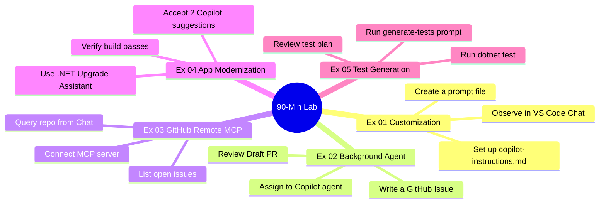

# Module 10 — Hands-on Lab

[](.)
[](.) [](.)

> **You will work through 5 self-contained exercises** that each build on a real capability from an earlier module. Each exercise is 15 minutes. Complete them in order for the best experience, or jump to any exercise independently.

---

## Lab Schedule

```mermaid
gantt
    title 90-Minute Hands-on Lab
    dateFormat mm
    axisFormat %M min

    section Setup
    Prerequisites check          :done,    setup, 00, 5m

    section Exercises
    Ex 01 — Customization        :active,  ex01, 05, 15m
    Ex 02 — Background Agent     :         ex02, 20, 15m
    Ex 03 — GitHub Remote MCP    :         ex03, 35, 15m
    Ex 04 — .NET Modernization   :         ex04, 50, 15m
    Ex 05 — Test Generation      :         ex05, 65, 15m

    section Wrap-up
    Review and Q&A               :         wrap, 80, 10m
```



---

## Exercise Overview



---

## Module Structure

```
10-hands-on-lab/
├── README.md                             ← This file
├── docs/
│   └── prerequisites.md                 ← Checklist + validation commands
├── exercises/
│   ├── exercise-01-customization.md
│   ├── exercise-02-background-agent.md
│   ├── exercise-03-mcp-github.md
│   ├── exercise-04-modernization.md
│   └── exercise-05-testing.md
└── permit-dashboard/                     ← Streamlit demo app for Coding Agent
    ├── app.py
    ├── requirements.txt
    ├── README.md
    └── screenshots/
```

---

## 🎯 Bonus: Permit Dashboard Demo App

As a bonus component, this module includes a **fully-functional Streamlit web application** perfect for demonstrating GitHub Coding Agent capabilities.

### Features
- 📊 **Interactive Analytics** - Real-time charts with Plotly
- 📋 **Permit Tracker** - Search, filter, and submit applications  
- 📈 **Trends Analysis** - Time-series and heatmap visualizations
- ℹ️ **About Page** - Built-in documentation and demo ideas

### Use Cases
Use this app to demonstrate **GitHub Coding Agent on GitHub.com**:
- Create issues requesting new features
- Let Coding Agent implement changes automatically
- Review and merge AI-generated pull requests
- Iterate on features with natural language

### Quick Start
```bash
cd permit-dashboard
pip install -r requirements.txt
streamlit run app.py
```

👉 **[Full Documentation](permit-dashboard/README.md)** — Setup guide, screenshots, and GitHub Coding Agent prompts

---

## Quick Navigation

| Exercise | Topic | Module Reference |
|---|---|---|
| [Exercise 01](exercises/exercise-01-customization.md) | Set up repo instructions + prompt file | Module 01 |
| [Exercise 02](exercises/exercise-02-background-agent.md) | Background Agent → Draft PR | Module 02 |
| [Exercise 03](exercises/exercise-03-mcp-github.md) | Connect GitHub Remote MCP | Module 03 |
| [Exercise 04](exercises/exercise-04-modernization.md) | .NET Upgrade Assistant + Copilot | Module 05 |
| [Exercise 05](exercises/exercise-05-testing.md) | Generate test plan + xUnit tests | Module 06 |

---

## Before Starting

Complete the [Prerequisites checklist](docs/prerequisites.md) first.

Estimated time: **5 minutes** (assuming software is pre-installed).

---

## Tips for the Lab

- Each exercise is **self-contained** — if you get stuck on one, move to the next
- **Copilot Chat is always available** — use it if you're unsure about a step
- Screenshots are not required — describe what you observe in the provided reflection prompts
- There is no single "correct" Copilot output — focus on the skill being practiced
