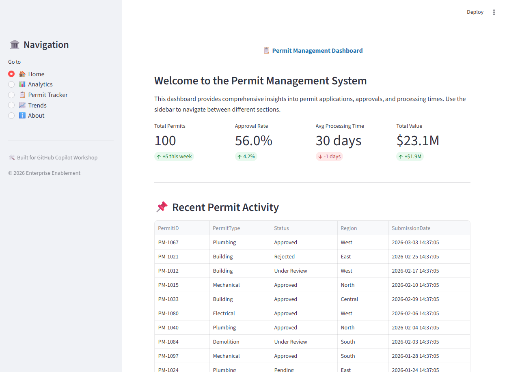
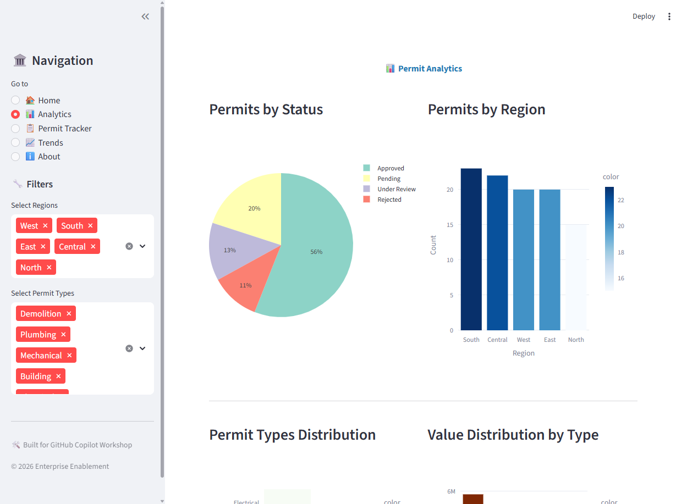
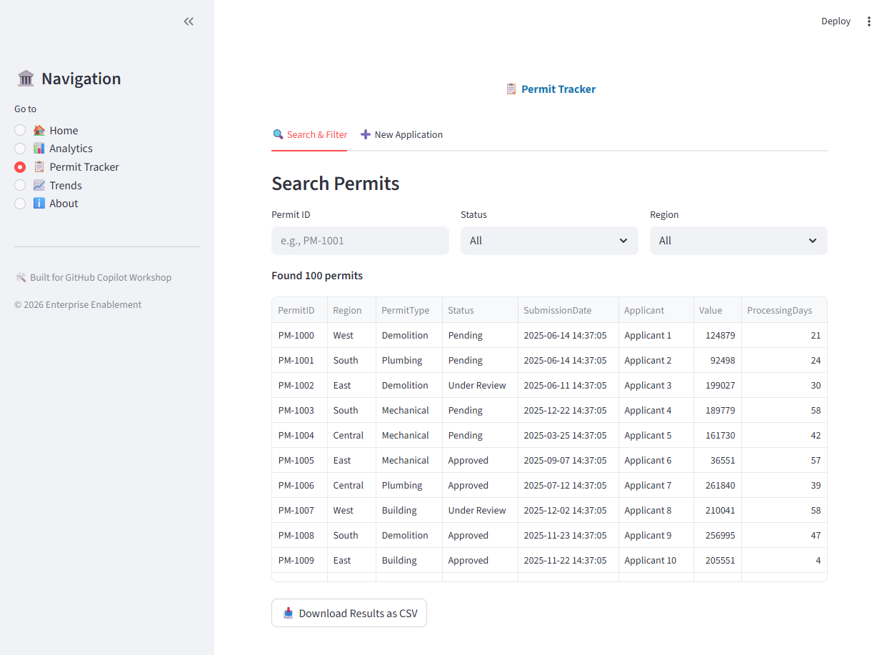
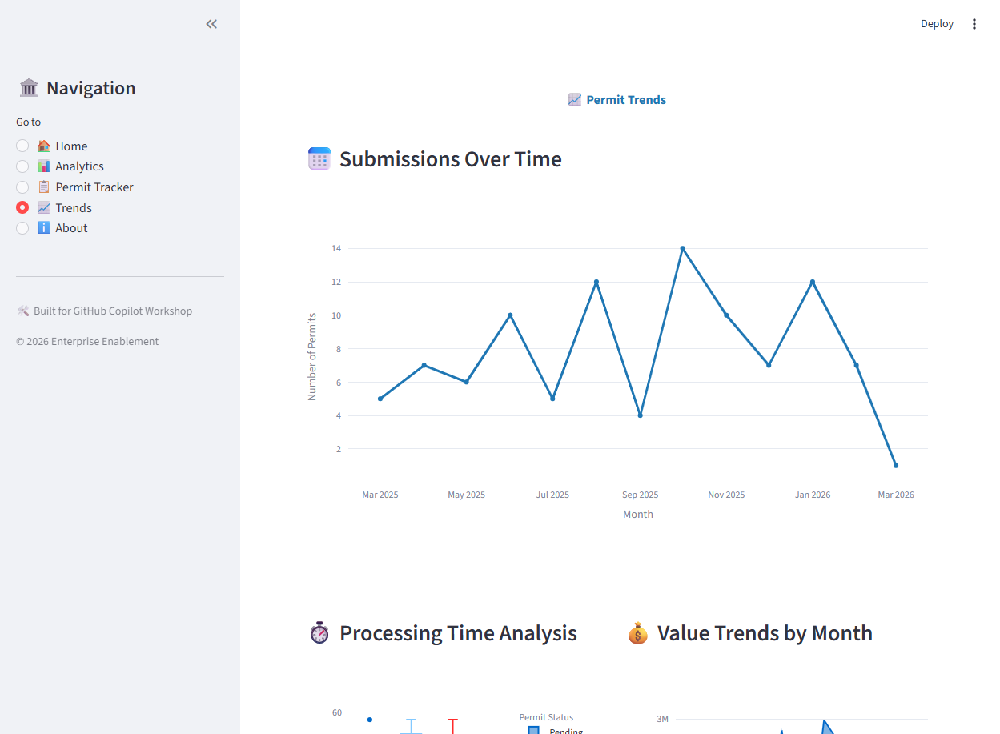
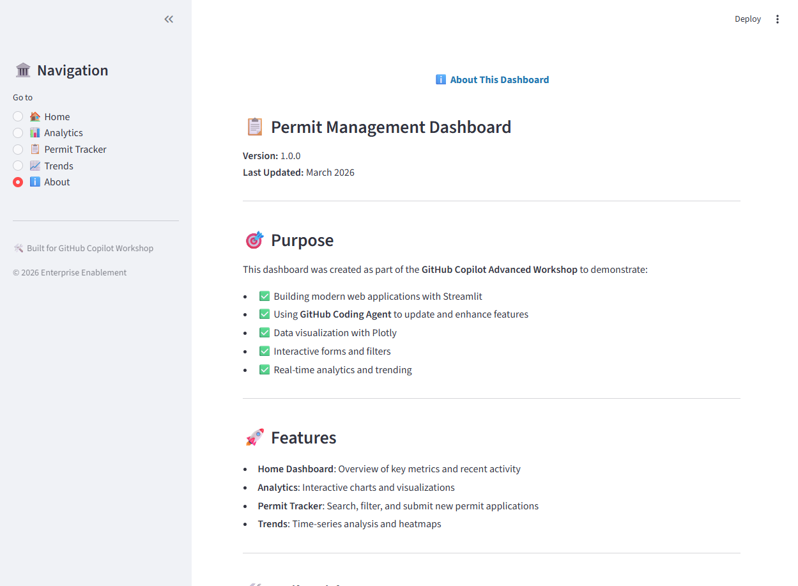

# 📋 Permit Management Dashboard

A modern, interactive web application built with Streamlit for managing and visualizing permit data. This app is designed to showcase **GitHub Coding Agent** capabilities by providing a feature-rich application that can be easily enhanced and modified.


---

## 🚀 Features

### 🏠 Home Dashboard
- **Key Metrics**: Total permits, approval rates, processing times, and total value
- **Recent Activity**: Latest permit submissions
- **Quick Actions**: Fast access to common tasks

### 📊 Analytics
- **Interactive Filters**: Region and permit type selection
- **Visual Analytics**: 
  - Pie chart for status distribution
  - Bar charts for regional analysis
  - Value distribution by type
- **Real-time Updates**: Charts update based on filter selection

### 📋 Permit Tracker
- **Search & Filter**: Find permits by ID, status, or region
- **Data Export**: Download results as CSV
- **New Applications**: Submit new permit applications with validation

### 📈 Trends
- **Time Series Analysis**: Monthly submission trends
- **Processing Time Analysis**: Box plots by status
- **Value Trends**: Area chart showing financial trends over time
- **Heatmap**: Activity visualization by region and type

### ℹ️ About
- Application documentation
- Feature overview
- Ideas for GitHub Coding Agent enhancements

---

## 📋 Prerequisites

- Python 3.9 or higher
- pip (Python package installer)

---

## 🛠️ Installation

1. **Navigate to the app directory:**
   ```bash
   cd 10-hands-on-lab/permit-dashboard
   ```

2. **Install dependencies:**
   ```bash
   pip install -r requirements.txt
   ```

---

## ▶️ Running the Application

Start the Streamlit server:

```bash
streamlit run app.py
```

The app will open automatically in your default browser at `http://localhost:8501`

---

## 📸 Screenshots

<table>
  <tr>
    <td><br/><b>Home Dashboard</b></td>
    <td><br/><b>Analytics Page</b></td>
  </tr>
  <tr>
    <td><br/><b>Permit Tracker</b></td>
    <td><br/><b>Trends Analysis</b></td>
  </tr>
  <tr>
    <td colspan="2"><br/><b>About Page</b></td>
  </tr>
</table>

---

## 🤖 Using GitHub Coding Agent

This app is perfect for demonstrating GitHub Coding Agent capabilities. Try these example prompts:

### 💡 Enhancement Ideas

#### 1. **Add New Visualizations**
```
"Add a scatter plot showing the relationship between project value and processing days on the Analytics page"
```

#### 2. **Implement Date Filters**
```
"Add a date range picker to the Analytics page that filters data by submission date"
```

#### 3. **Create New Pages**
```
"Create a new 'Admin Dashboard' page with user management and system statistics"
```

#### 4. **Add Dark Mode**
```
"Implement a dark mode toggle in the sidebar that changes the entire app theme"
```

#### 5. **Export Features**
```
"Add a button to export the Trends page charts as a PDF report"
```

#### 6. **Enhanced Forms**
```
"Add file upload capability to the New Application form for supporting documents"
```

#### 7. **Notifications**
```
"Implement a notification system that shows alerts for pending permits in the sidebar"
```

#### 8. **Data Validation**
```
"Add comprehensive validation to the New Application form including email format and phone number validation"
```

---

## 🎯 GitHub Coding Agent Workflow

### Method 1: Using Issues

1. **Create an Issue** on GitHub with your enhancement request
2. **Tag it** with `enhancement` or `feature`
3. **Use Coding Agent** in the issue thread:
   - Ask Coding Agent to implement the feature
   - Review the proposed changes
   - Approve or request modifications
4. **Let Coding Agent** create a PR automatically

### Method 2: Using Pull Requests

1. **Create a PR** with a description of what you want to change
2. **Use Coding Agent** in the PR thread
3. **Review the code** changes inline
4. **Iterate** until satisfied
5. **Merge** the PR

### Method 3: Direct Code Changes

1. **Open a file** on GitHub.com
2. **Press `.`** to open VS Code Web
3. **Use Copilot Chat** to make changes
4. **Commit** directly or create a PR

---

## 📁 Project Structure

```
permit-dashboard/
│
├── app.py                  # Main Streamlit application
├── requirements.txt        # Python dependencies
├── README.md              # This file
│
└── screenshots/           # Application screenshots
    ├── 01-home.png
    ├── 02-analytics.png
    ├── 03-tracker.png
    ├── 04-trends.png
    └── 05-about.png
```

---

## 🔧 Dependencies

| Package | Version | Purpose |
|---------|---------|---------|
| `streamlit` | 1.31.0 | Web application framework |
| `pandas` | 2.2.0 | Data manipulation and analysis |
| `plotly` | 5.18.0 | Interactive visualizations |
| `numpy` | 1.26.3 | Numerical computing |

---

## 🐛 Common Issues

### Port Already in Use

If you see "Address already in use", kill the existing process:

**Windows:**
```powershell
Get-Process -Name streamlit | Stop-Process -Force
```

**Linux/Mac:**
```bash
pkill -f streamlit
```

Or run on a different port:
```bash
streamlit run app.py --server.port 8502
```

### Missing Dependencies

If you encounter import errors:
```bash
pip install --upgrade -r requirements.txt
```

---

## 📝 License

MIT License - feel free to use and modify for your workshops!

---

## 🙋 Support

Part of the **GitHub Copilot Advanced Workshop**  
📚 [Workshop Documentation](../../README.md)  
📖 [Module 09 - Copilot on GitHub](../../09-copilot-on-github/README.md)

---

## 🎓 Learning Objectives

By using this app with GitHub Coding Agent, you'll learn to:

- ✅ Create and modify Streamlit applications
- ✅ Use GitHub Coding Agent for autonomous code updates
- ✅ Review and approve AI-generated code changes
- ✅ Iterate on features with natural language prompts
- ✅ Understand the PR workflow with Coding Agent
- ✅ Test and validate automated changes

---

**Built with ❤️ for the GitHub Copilot Advanced Workshop**
