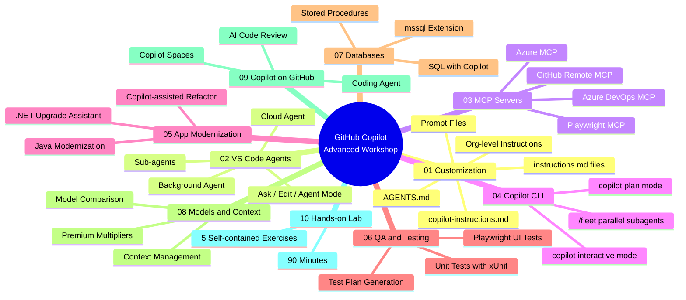

# GitHub Copilot Advanced Workshop
### Enterprise Developer Enablement

[](https://github.com/features/copilot)
[](https://code.visualstudio.com/)
[](https://dotnet.microsoft.com/)
[](LICENSE)
[](CHANGELOG.md)

---

> **Audience:** Enterprise developers with basic Copilot familiarity, ready to move beyond autocomplete.
> **Duration:** Full-day workshop (~6.5 hours) or self-paced across multiple sessions.
> **Format:** Each module is self-contained — work through them in any order.

---

## What You'll Learn

By the end of this workshop, developers will be able to:

- **Control Copilot's context** at the repository and workstation level using instruction files, prompt files, and `AGENTS.md`
- **Choose the right agent mode** — Ask, Edit, Agent, Background Agent, or Cloud Agent — for any given task
- **Connect Copilot to external systems** via MCP servers (Azure DevOps, Azure, GitHub, Playwright)
- **Use Copilot in the terminal** with the standalone `copilot` CLI — an AI agent that can edit code, run git operations, interact with GitHub.com (PRs, issues, workflows), and run parallel subtasks via `/fleet`
- **Modernize legacy applications** using the .NET Upgrade Assistant and Java Modernization Assistant alongside Copilot
- **Generate high-quality tests** — xUnit unit tests, integration tests, and Playwright end-to-end tests — using Agent mode
- **Write and optimize T-SQL** against a realistic enterprise schema using the mssql extension and Copilot Chat
- **Select the right AI model** for each task based on speed, reasoning depth, cost, and plan availability
- **Use Copilot features on GitHub.com** — Coding Agent, AI code review on PRs, and Copilot Spaces

---

## Workshop Map



---

## Module Navigation

| # | Module | What It Covers | Time |
|---|--------|----------------|------|
| [01](01-customization/README.md) | **Customization** | `copilot-instructions.md`, `AGENTS.md`, `*.instructions.md` (file-based, `applyTo` globs), prompt files, agent skills, org-level instructions, instruction priority resolution | 45 min |
| [02](02-vscode-agents/README.md) | **VS Code Agents** | Ask / Edit / Agent mode comparison, Background Agent (async, returns a PR), Copilot Cloud Agent, sub-agent delegation patterns, agent selection decision guide | 40 min |
| [03](03-mcp-samples/README.md) | **MCP Servers** | Azure DevOps MCP (work items, PRs, pipelines), Azure MCP (resources, storage, Key Vault), GitHub Remote MCP (repos, issues), Playwright MCP (browser automation) — config + prompts for each | 30 min |
| [04](04-copilot-cli/README.md) | **Copilot CLI** | Standalone `copilot` AI agent in your terminal — interactive sessions, plan mode (`Shift+Tab`), programmatic mode (`copilot -p "..."`), local code + GitHub.com tasks (PRs, issues, workflows), `/fleet` for parallel subagents, customization (MCP servers, custom agents, Copilot Memory) | 30 min |
| [05](05-app-modernization/README.md) | **App Modernization** | .NET Upgrade Assistant (Framework 4.7 → .NET 8, incremental steps), Java Modernization Assistant (Java 8 → 17/21), hands-on legacy .NET Web API sample | 45 min |
| [06](06-qa-testing/README.md) | **QA & Testing** | xUnit + Moq unit tests via `generate-tests` prompt, integration tests with `WebApplicationFactory`, Playwright end-to-end UI tests, Agent mode test planning | 50 min |
| [07](07-databases/README.md) | **Databases** | mssql VS Code extension, natural-language → T-SQL with Copilot, real `OntarioPermits` schema (Regions, Applicants, Permits, StatusHistory), stored procedures, SQL security review | 35 min |
| [08](08-models-context/README.md) | **Models & Context** | All Copilot-supported models (Anthropic, Google, OpenAI, xAI, GitHub), speed vs reasoning quadrant, premium request multipliers, context window management strategies | 25 min |
| [09](09-copilot-on-github/README.md) | **Copilot on GitHub.com** | Copilot Coding Agent (issue → PR lifecycle), AI code review on pull requests, Copilot Spaces as knowledge hubs, `copilot-review-instructions.md` | 35 min |
| [10](10-hands-on-lab/README.md) | **Hands-on Lab** | 5 self-contained exercises: Customization, Background Agent, GitHub Remote MCP, .NET Modernization, Test Generation — each 15 min, ~90 min total | 90 min |

**Total guided workshop time: ~6.5 hours** (excluding breaks)

---

## Quick Start

```bash
# 1. Clone the repo
git clone https://github.com/your-org/GitHubCopilot-AdvancedRepo.git
cd GitHubCopilot-AdvancedRepo

# 2. Open in VS Code — Copilot instructions load automatically
code .

# 3. Verify VS Code extensions are installed (see Prerequisites below)

# 4. For MCP samples — install Playwright browser (Module 03)
cd 03-mcp-samples && npm install
npx playwright install chromium

# 5. For QA/Testing — install Playwright test dependencies (Module 06)
cd ../06-qa-testing/playwright-samples && npm install && npx playwright install

# 6. For Database module — connect to LocalDB with the mssql extension (Module 07)
#    Run: 07-databases/samples/schema.sql then 07-databases/samples/seed-data.sql

# 7. For CLI module — install the standalone Copilot CLI (Module 04)
#    See: https://docs.github.com/en/copilot/how-tos/set-up/install-copilot-cli
copilot --version   # verify after installing
```

---

## Prerequisites

| Requirement | Version | Install |
|-------------|---------|---------|
| VS Code | Latest stable | [code.visualstudio.com](https://code.visualstudio.com) |
| GitHub Copilot extension | Latest | [VS Code Marketplace](https://marketplace.visualstudio.com/items?itemName=GitHub.copilot) |
| GitHub Copilot Chat extension | Latest | [VS Code Marketplace](https://marketplace.visualstudio.com/items?itemName=GitHub.copilot-chat) |
| .NET SDK | 8.0+ | [dot.net](https://dotnet.microsoft.com/download) |
| Node.js | 20 LTS | [nodejs.org](https://nodejs.org) |
| GitHub CLI | Latest | [cli.github.com](https://cli.github.com) |
| SQL Server LocalDB | 2019+ | [Microsoft Docs](https://learn.microsoft.com/sql/database-engine/configure-windows/sql-server-express-localdb) |
| mssql extension | Latest | [VS Code Marketplace](https://marketplace.visualstudio.com/items?itemName=ms-mssql.mssql) |
| GitHub Copilot plan | Pro / Business / Enterprise | [github.com/features/copilot](https://github.com/features/copilot) |

> **New to Copilot?** You need at minimum a **Copilot Pro** plan. Business/Enterprise plans unlock additional models and org-level policy features covered in Modules 08 and 09.

---

## Repository Structure

```
GitHubCopilot-AdvancedRepo/
├── .github/
│   ├── copilot-instructions.md        ← Active repo-level instructions (live demo for Module 01)
│   ├── instructions/
│   │   ├── csharp-standards.instructions.md   ← File-based instructions (applyTo: **/*.cs)
│   │   └── test-standards.instructions.md     ← File-based instructions (applyTo: **/*Tests.cs)
│   └── prompts/                       ← Reusable prompt files (live demo for Module 01)
│       ├── code-review.prompt.md
│       ├── generate-tests.prompt.md
│       ├── explain-legacy.prompt.md
│       ├── sql-query.prompt.md
│       └── modernize-dotnet.prompt.md
├── AGENTS.md                          ← Multi-agent compatible always-on instructions (root level)
├── CONTRIBUTING.md
├── CHANGELOG.md
├── LICENSE
├── generate-presentation.js           ← Generates the workshop PPTX (Node.js + pptxgenjs)
├── GitHub-Copilot-Advanced-Workshop.pptx  ← Pre-built workshop slide deck (GitHub dark theme)
├── 01-customization/                  ← Instruction files, prompt files, agent skills, org instructions
├── 02-vscode-agents/                  ← Background Agent, cloud agents, sub-agents, selection guide
├── 03-mcp-samples/                    ← Azure DevOps, Azure, GitHub Remote, Playwright MCP configs
│   ├── azure-devops-mcp/
│   ├── azure-mcp/
│   ├── github-remote-mcp/
│   └── playwright-mcp/
├── 04-copilot-cli/                    ← CLI features, Fleet, annotated demos
├── 05-app-modernization/              ← .NET 4.7 sample, Java 8 sample, migration docs
├── 06-qa-testing/                     ← xUnit tests, Playwright samples, test plan docs
├── 07-databases/                      ← mssql config, OntarioPermits schema + seed data, SQL docs
├── 08-models-context/                 ← Model reference table, multipliers, context management
├── 09-copilot-on-github/              ← Coding Agent docs, code review setup, Spaces guide
└── 10-hands-on-lab/                   ← 5 exercises + prerequisites checklist
```

> **The `.github/` folder is a live demo.** The instruction files and prompt files there are *actively applied* to this repo whenever you open it in VS Code with GitHub Copilot. They are the hands-on demonstration for [Module 01](01-customization/README.md).

---

## How to Use This Repo

### Workshop Facilitators (Full Day)

1. **Before the workshop:** Ensure all attendees have the prerequisites installed. Use `10-hands-on-lab/docs/prerequisites.md` as the pre-workshop checklist.
2. **Modules 01–03** (morning): Customization → Agents → MCP Servers — these build the foundation.
3. **Modules 04–07** (afternoon, first half): CLI → Modernization → Testing → Databases — practical, hands-on.
4. **Modules 08–09** (afternoon, second half): Models & Context → GitHub.com features — strategic knowledge.
5. **Module 10** (closing 90 min): Run the hands-on lab exercises as reinforcement. Attendees work independently; facilitator circulates.
6. **Debrief:** Use the workshop PPTX (`GitHub-Copilot-Advanced-Workshop.pptx`) for framing, transitions, and wrap-up slides.

### Self-Paced Learners

Start with **[Module 01 — Customization](01-customization/README.md)**. The concepts there (instruction files, context control) underpin everything else. Then work through modules in any order — each `README.md` is designed to stand alone.

**Suggested learning paths:**

| Goal | Modules |
|------|---------|
| Focus on AI-assisted workflows | 01 → 02 → 09 |
| Connect Copilot to your toolchain | 01 → 03 → 04 |
| Improve code quality and testing | 01 → 06 → 07 |
| Modernize a legacy .NET app | 01 → 05 → 06 → 10 |
| Understand model costs/selection | 08 → 02 → 09 |

### Experienced Copilot Users

Jump directly to any module. Each `README.md` opens with a clear "What you'll learn" statement. The topics most likely to have new content for experienced users:

- **Module 03** — MCP server configurations (new in 2025, evolving fast)
- **Module 04** — Copilot CLI + `/fleet` (standalone `copilot` command with parallel subagents)
- **Module 08** — Current model landscape and premium multiplier rates
- **Module 09** — Copilot Coding Agent end-to-end lifecycle

---

## Workshop Materials

| Resource | Description |
|----------|-------------|
| [`GitHub-Copilot-Advanced-Workshop.pptx`](GitHub-Copilot-Advanced-Workshop.pptx) | Full slide deck — GitHub dark theme, 27 slides covering all 10 modules. Open in PowerPoint. Logo placeholder boxes are provided for you to drop in your org's logo. |
| [`generate-presentation.js`](generate-presentation.js) | Node.js script that regenerates the PPTX from source. Run `node generate-presentation.js` after making changes. Requires `npm install pptxgenjs` in the repo root. |
| [`.github/prompts/`](.github/prompts/) | 5 reusable prompt files — usable immediately in VS Code Chat (open via `@workspace /prompt`). |
| [`10-hands-on-lab/exercises/`](10-hands-on-lab/exercises/) | 5 self-contained markdown exercise files for the lab session. |

---

## Contributing

See [CONTRIBUTING.md](CONTRIBUTING.md) for guidelines on adding new content, fixing samples, or updating model data.

Pull requests are welcome. Please include a description of what changed and update [CHANGELOG.md](CHANGELOG.md).

---

## License

[MIT](LICENSE) © 2026 — Enterprise GitHub Copilot Advanced Workshop.

---

*See [CHANGELOG.md](CHANGELOG.md) for version history.*
